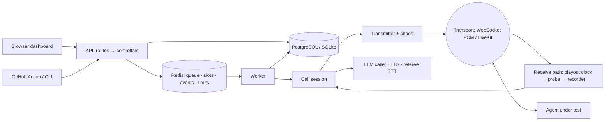

# Architecture

A modular monolith with one auxiliary process role (SRS 5). One codebase, one database, two roles:
the **API** (FastAPI: REST, server-sent events, reports, and the built dashboard) and the **worker**
(same code, different entrypoint: consumes call jobs and holds media sessions). They communicate only
through the database and Redis. In development — or a single-container deployment — the worker runs
inside the API process with SQLite and an in-process Redis (D-12).

## The load-bearing property

One caller process holds both the transmit and the receive timeline on one clock
(`gauntlet.common.clock.now_ns`), so no latency carries clock skew. The measurement tap sits on the raw
received stream before anything else can touch it.

## Backend layout (`backend/gauntlet/`)

| Package | SRS component |
|---|---|
| `server.py`, `routes/`, `controllers/`, `middleware/` | ARC-011 API (request id → CORS → error envelope → routers) |
| `db/` | DB-001..019, workspace-scoped repository (ARC-012 isolation) |
| `orchestrator/` | ARC-016 run manager, ARC-017 queue/slots/sweeper, ARC-019 event bus |
| `worker/` | Role B: call executor |
| `caller/` | ARC-030 session state machine, ARC-031 synthesis, ARC-032 interruptions, adapters ARC-020/021 |
| `media/` | ARC-022 probe, ARC-024 chaos, recorder, noise |
| `metrics/` | ARC-023 metric computer, definitions, disclosures |
| `referee/` | ARC-040 transcription, ARC-041 evaluation |
| `scoring/` | ARC-042 score, ARC-044 compare and gate |
| `cost/` | ARC-043 |
| `suites/` | ARC-015 loader, schemas, hashing |
| `reports/` | ARC-045 |
| `cli/` | ARC-060 |
| `common/` | clock, seeds (ARC-018), crypto (ARC-052), URL guard (ARC-051), storage, settings |

`fixtures/calibration_target` is ARC-025 and also the WebSocket reference server (D-04);
`calibration/run_calibration.py` is ARC-070; `.github/actions/gauntlet-gate` is ARC-061.

## A call, end to end

Run creation plans one call per scenario × persona × repeat, each with a derived seed and a pre-computed
interruption schedule, and enqueues them. A worker claims a call (conditional `pending → dialling`),
takes a leased concurrency slot (the measured peak is updated in the same transaction), dials, and runs
the session: greeting window → opening → pursue (model words, scripted fallback) → verify → close. Each
turn records the caller's actual transmit times, the agent's playout times, latency, barge-in, rig
overhead and epoch. After hang-up: persist turns and events, upload the two-channel WAV, evaluate, charge
cost, release the slot. When the last call is terminal the run is finalised deterministically.

## Failure posture

Every call ends with exactly one terminal status and reason code. Leases expire and the sweeper reclaims
lost calls (one retry). Referee outage never substitutes another engine. Provider calls inside a live
turn are never retried. Redis down: live view degrades, results remain readable.
